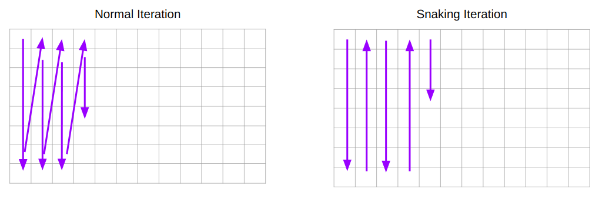

# 🐍 SnakeIterator.jl

[](https://travis-ci.com/tlnagy/SnakeIterator.jl)
[](https://codecov.io/gh/tlnagy/SnakeIterator.jl)

A micropackage implementing a snaking iterator for use with 2D arrays.

## What?

See the diagram below for a comparison of normal column-wise (Julia default)
iteration versus snaking iteration. It can handle iteration of arbitrary 2D
arrays.



## Why?

A common use case is minimizing the time spent on physical movement between
consecutive wells when iterating over a multiwell plate. This is useful for
programming robots to handle 96-well or 386-well plates during microscopy,
liquid handling, etc 

## How?

The only exported function is `snake` and it constructs a `SnakeIterator` that
should just work (tm) like any other iterator.

```julia
using SnakeIterator

arr = reshape(1:16, 4, 4)

for i in snake(arr)
    @show i
end
```